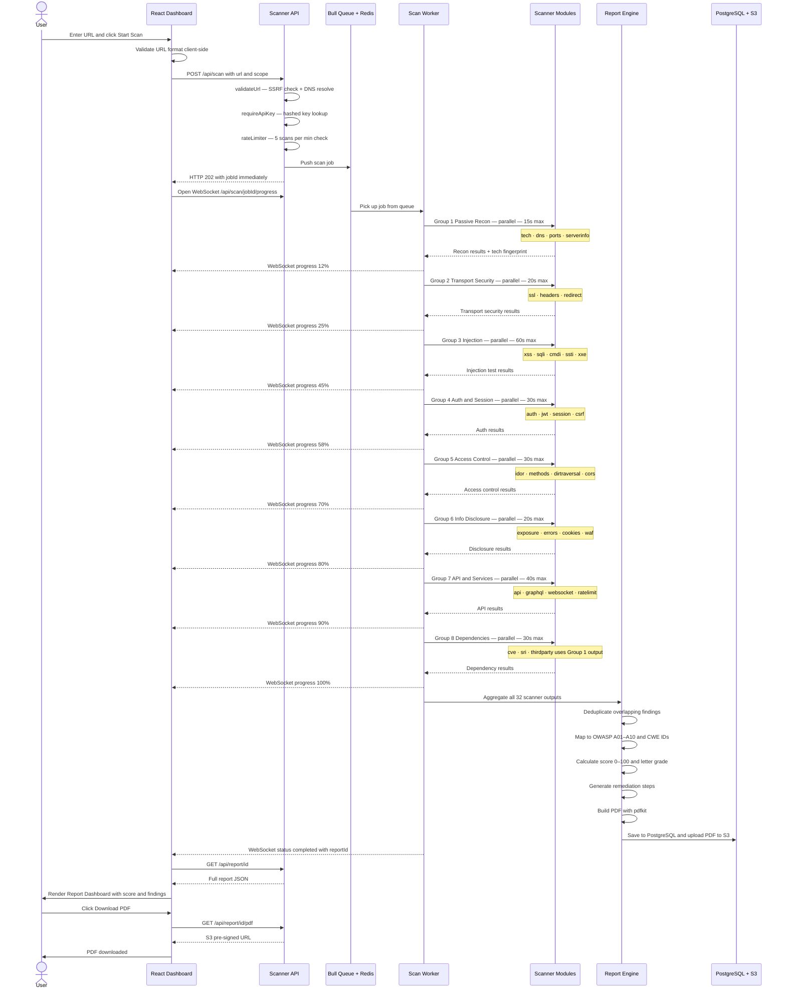
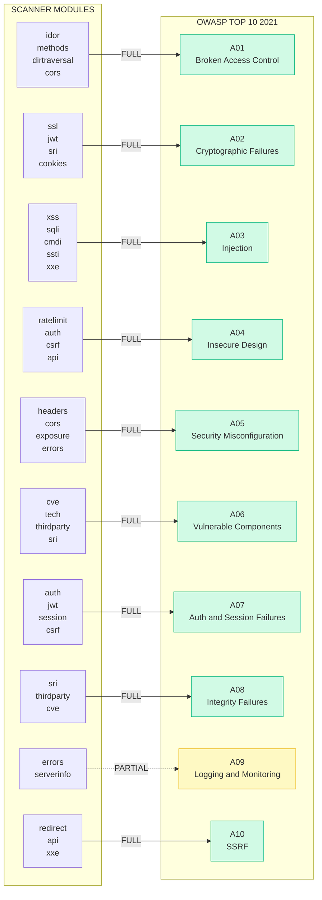
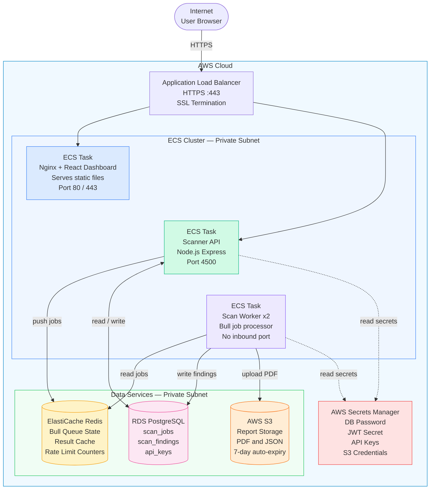

# Somo Cybersecurity Service — Architecture Diagrams

## Diagram 1 — Full System Architecture (7 Layers)

```mermaid
flowchart TB
    subgraph L1["  LAYER 1 — CLIENT   React + Vite + RTK Query  "]
        direction LR
        P1["URL Input\n+ Config"]
        P2["Scan Progress\nLive WebSocket"]
        P3["Report Dashboard\nScore · Findings · PDF"]
        P4["History\n& Compare"]
        P1 ~~~ P2 ~~~ P3 ~~~ P4
    end

    subgraph L2["  LAYER 2 — API GATEWAY  "]
        NGX["Nginx\nTLS Termination · Rate Limiting · WAF Rules · Request Logging"]
    end

    subgraph L3["  LAYER 3 — SCANNER API   Node.js + Express  :4500  "]
        direction LR
        MW["Middleware Chain\nvalidateUrl → requireApiKey → rateLimiter → helmet → cors → logger"]
        subgraph RT["Routes"]
            direction LR
            R1["POST /api/scan"]
            R2["GET /api/scan/:id"]
            R3["GET /api/report/:id"]
            R4["WS /api/scan/:id/progress"]
        end
    end

    subgraph L4["  LAYER 4 — QUEUE & WORKERS  "]
        direction LR
        BQ["Bull Queue\nRedis-backed\nqueued → active → completed"]
        WK["Scan Orchestrator\nWorker ×2\n5 min timeout · 2 retries"]
        BQ -->|"pick up job"| WK
    end

    subgraph L5["  LAYER 5 — SCANNER MODULES   32 Scanners · 8 Groups  "]
        direction LR
        G1["Group 1\nPassive Recon\ntech · dns · ports · serverinfo"]
        G2["Group 2\nTransport\nssl · headers · redirect"]
        G3["Group 3\nInjection\nxss · sqli · cmdi · ssti · xxe"]
        G4["Group 4\nAuth & Session\nauth · jwt · session · csrf"]
        G5["Group 5\nAccess Control\nidor · methods · dirtraversal · cors"]
        G6["Group 6\nInfo Disclosure\nexposure · errors · cookies · waf"]
        G7["Group 7\nAPI & Services\napi · graphql · websocket · ratelimit"]
        G8["Group 8\nDependencies\ncve · sri · thirdparty"]
    end

    subgraph L6["  LAYER 6 — REPORT ENGINE  "]
        direction LR
        SC["Score Calculator\n0–100 · A/B/C/D/F\nCVSS-weighted"]
        FA["Findings Aggregator\nDedup · Sort · Remediate"]
        OM["OWASP Mapper\nA01–A10 · CWE IDs"]
        PB["PDF Builder\npdfkit"]
        SC ~~~ FA ~~~ OM ~~~ PB
    end

    subgraph L7["  LAYER 7 — DATA LAYER  "]
        direction LR
        RD[("Redis\nQueue State\nCache 24h\nRate Limits")]
        PG[("PostgreSQL\nscan_jobs\nscan_findings\napi_keys")]
        S3[("AWS S3\nPDF Reports\n7-day TTL")]
    end

    L1 -->|"HTTPS + WSS"| L2
    L2 -->|"reverse proxy"| L3
    L3 -->|"push job → 202 jobId"| L4
    L4 -->|"orchestrate 8 groups"| L5
    L5 -->|"raw findings from all 32 scanners"| L6
    L6 -->|"save report"| L7

    style L1 fill:#dbeafe,stroke:#3b82f6,color:#1e3a5f
    style L2 fill:#fef3c7,stroke:#f59e0b,color:#78350f
    style L3 fill:#d1fae5,stroke:#10b981,color:#064e3b
    style L4 fill:#ede9fe,stroke:#8b5cf6,color:#3b0764
    style L5 fill:#fee2e2,stroke:#ef4444,color:#7f1d1d
    style L6 fill:#fce7f3,stroke:#ec4899,color:#831843
    style L7 fill:#f0fdf4,stroke:#22c55e,color:#14532d
```

---

## Diagram 2 — Scanner Modules Detail (All 32 Scanners)

```mermaid
flowchart TB
    ORCH(["Scan Orchestrator\nRuns groups 1 to 8 in sequence\nWithin each group scanners run in parallel"])

    subgraph G1["GROUP 1 — PASSIVE RECON   15s · Runs First · Output feeds Group 8"]
        direction LR
        S1A["tech\nWappalyzer\nFramework · CMS · CDN\nVersion IDs"]
        S1B["dns\nA · MX · TXT · NS\nSPF · DKIM · DMARC\nZone Transfer"]
        S1C["ports\nnmap\nOpen Ports · Services\nBanner Grab"]
        S1D["serverinfo\nServer Header\nX-Powered-By\nVersion Disclosure"]
    end

    subgraph G2["GROUP 2 — TRANSPORT SECURITY   20s"]
        direction LR
        S2A["ssl\nCert Expiry\nTLS Version 1.2+\nWeak Ciphers · Chain"]
        S2B["headers\nHSTS · X-Frame-Options\nContent-Security-Policy\nXCTO · Referrer-Policy"]
        S2C["redirect\nHTTP to HTTPS\nOpen Redirect\nChain Loops · Mixed Content"]
    end

    subgraph G3["GROUP 3 — INJECTION ATTACKS   60s"]
        direction LR
        S3A["xss\nReflected XSS\nStored XSS Probe\nDOM-based XSS"]
        S3B["sqli\nError-based\nBoolean-blind\nTime-based · UNION"]
        S3C["cmdi\n; ls\n| whoami\n&& id · Delay detect"]
        S3D["ssti\n7 times 7\nJinja2 · Twig\nEJS · Freemarker"]
        S3E["xxe\nXML Entity Injection\nFile Read\nSSRF via XML"]
    end

    subgraph G4["GROUP 4 — AUTH & SESSION   30s"]
        direction LR
        S4A["auth\nDefault Credentials\nAccount Lockout\nUsername Enumeration"]
        S4B["jwt\nalg none attack\nWeak Secret\nAlgorithm Confusion"]
        S4C["session\nSession Fixation\nToken Entropy\nLogout Invalidation"]
        S4D["csrf\nCSRF Token Check\nSameSite Cookie\nDouble Submit"]
    end

    subgraph G5["GROUP 5 — ACCESS CONTROL   30s"]
        direction LR
        S5A["idor\nSequential ID Enum\nUUID vs Integer\nForced Browsing"]
        S5B["methods\nPUT · DELETE · TRACE\nMethod Tunnelling\nXST Attack"]
        S5C["dirtraversal\n../../etc/passwd\nNull Byte Inject\nURL Encoding Bypass"]
        S5D["cors\nOrigin Reflection\nWildcard with Creds\nPreflight Bypass"]
    end

    subgraph G6["GROUP 6 — INFORMATION DISCLOSURE   20s"]
        direction LR
        S6A["exposure\n/.env · /.git/config\n/backup.zip · /.DS_Store\nDirectory Listing"]
        S6B["errors\nStack Traces\nDB Error Messages\nInternal Path Leakage"]
        S6C["cookies\nSecure Flag\nHttpOnly Flag\nSameSite Attribute"]
        S6D["waf\nVendor Detection\nCloudflare · AWS WAF\nBypass Test"]
    end

    subgraph G7["GROUP 7 — API & SERVICES   40s"]
        direction LR
        S7A["api\nEndpoint Fuzzing\nAuth Coverage Check\nMass Assignment"]
        S7B["graphql\nIntrospection Enabled\nQuery Depth Limit\nBatch Abuse"]
        S7C["websocket\nAuth on WS Upgrade\nOrigin Validation\nMessage Flooding"]
        S7D["ratelimit\n429 Enforcement\nIP Spoof Bypass\nDistributed Bypass"]
    end

    subgraph G8["GROUP 8 — DEPENDENCIES   30s · Uses Group 1 output"]
        direction LR
        S8A["cve\nNVD API Query\nCVSS Score Lookup\nExploit Availability"]
        S8B["sri\nscript integrity check\nlink integrity check\nCDN SRI Missing"]
        S8C["thirdparty\nTracking Scripts\nHTTP-loaded JS\nMalicious Domains"]
    end

    ORCH --> G1
    G1 -->|"next"| G2
    G2 -->|"next"| G3
    G3 -->|"next"| G4
    G4 -->|"next"| G5
    G5 -->|"next"| G6
    G6 -->|"next"| G7
    G7 -->|"next"| G8
    G1 -->|"tech fingerprint\nfeeds CVE scanner"| G8

    style G1 fill:#dbeafe,stroke:#3b82f6
    style G2 fill:#fef9c3,stroke:#eab308
    style G3 fill:#fee2e2,stroke:#ef4444
    style G4 fill:#ede9fe,stroke:#8b5cf6
    style G5 fill:#ffedd5,stroke:#f97316
    style G6 fill:#d1fae5,stroke:#10b981
    style G7 fill:#fce7f3,stroke:#ec4899
    style G8 fill:#f1f5f9,stroke:#64748b
```

---

## Diagram 3 — Scan Lifecycle Data Flow

---

## Diagram 4 — OWASP Top 10 Coverage Map

---

## Diagram 5 — Deployment Architecture (AWS ECS)

---

## Quick Reference — All 5 Diagrams

| Diagram | What It Shows | Best Used For |
|---|---|---|
| Diagram 1 | 7 Architecture Layers overview | Executive presentation |
| Diagram 2 | All 32 scanners in 8 groups with details | Technical deep-dive |
| Diagram 3 | Step-by-step scan lifecycle (sequence) | Developer walkthrough |
| Diagram 4 | OWASP Top 10 coverage map | Security audit review |
| Diagram 5 | AWS ECS deployment architecture | DevOps / Infrastructure |
